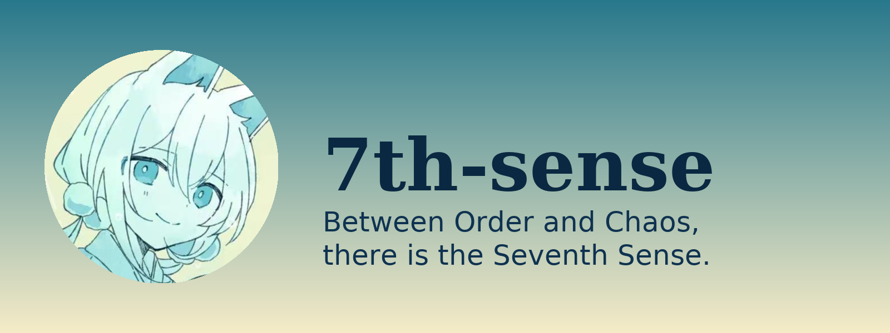

# 7th-sense


<p align="center">
  <a href="https://github.com/NightGaster/7th-sense/stargazers">
    
  </a>
  <a href="https://github.com/NightGaster/7th-sense/network/members">
    
  </a>
  

<hr style="border:1px solid #bbb; margin:30px 0;"/>

  
</p>


<div align="center">



</div>


# **7th-sense**
### *“在秩序与混乱之间，存在着第七感。”*

</div>

---


<hr style="border:1px solid #bbb; margin:30px 0;"/>

## 🌟 项目简介

**7th-sense** 是一个用于学习 **Git 工作流** 的示例仓库，  
同时也是一个 **完全混乱、不设限、任何提交都能被合并的实验场**。

这个仓库刻意保持两种对立主题的并存：

### ✅ **秩序（Order）——规范、干净、严谨的 Git 实践**  
### ✅ **混乱（Chaos）——任何内容皆可提交，任何提交都可能被合并**

这是一个学习与实验共存的空间。

---


<hr style="border:1px solid #bbb; margin:30px 0;"/>

## 🍊 关于项目吉祥物——小柑

<div align="center">

</div>


> 以下设定由 **LoarenKonpeki** 创作。

小柑原本是绀碧岛人类社区中的 **便民服务机器人**，负责：

- 查询资料  
- 办理手续  
- 处理各种事务  
- 协助居民沟通  

在一场突如其来的 **大火灾** 中，她启动了自我保护系统，缩至最低能耗并躲入废墟中待机。

后来被 **鹭岚主人** 和 **奎娅主人** 发现与重新启动。  
然而严重的热损毁导致：

- 大部分程序损坏  
- 数据文件丢失  
- 语言模块断断续续  
- 记忆缺失严重  

但她依旧温柔、忠诚，会努力说：

> “小、小柑会尽力为……为为为您服——务的……”

她象征着：

- ✅ **秩序**（她原本的职责）  
- ✅ **混乱**（她损坏后的状态）  

这正是本仓库的主题。

---


<hr style="border:1px solid #bbb; margin:30px 0;"/>

## 📚 仓库用途：**秩序 × 混乱双轨并行**

### 🟦 **1. 秩序（Order）模式：规范的 Git 学习**

适合用于学习：

- 保持 main 干净  
- 功能分支开发  
- 清晰的 commit message  
- PR → Review → Merge  
- 同步 upstream  
- 团队协作的基本流程  

---

### 🔶 **2. 混乱（Chaos）模式：七感混沌区**

这里允许：

- ✅ 任意文件  
- ✅ 任意格式  
- ✅ 任意内容  
- ✅ 任意提交  
- ✅ 任意命名  
- ✅ 任意结构  
- ✅ 任意风格  
- ✅ 任意实验  

你提交什么，它就是什么。

> “秩序教会我们如何写代码；  
> 混乱教会我们：你可以写任何东西。”

---


<hr style="border:1px solid #bbb; margin:30px 0;"/>

## 📁 仓库结构（会随着混乱持续扩展）

```
7th-sense/
├── hello.py
├── README.md
├── README_EN.md
├── .gitignore
├── assets/
│   ├── banner_7thsense.png
│   └── kokan-avatar.png
└── chaos/
```

---


<hr style="border:1px solid #bbb; margin:30px 0;"/>

## 🤝 贡献方式

### ✅ **秩序路线（推荐学习）**
1. Fork  
2. Clone  
3. 新建分支  
4. 开发  
5. Push  
6. 发 PR  

### ✅ **混乱路线（娱乐模式）**
```
git add .
git commit -m "???"
git push
```
然后发 PR。

所有提交皆可。

---


<hr style="border:1px solid #bbb; margin:30px 0;"/>

## 📜 版权声明

- 小柑（Kokan）为 **LoarenKonpeki** 的原创角色  
- 本仓库的混乱创作允许二创（非商业）  
- 如引用角色设定，请注明来源  

---


<hr style="border:1px solid #bbb; margin:30px 0;"/>

## ✨ 结语

<div align="center">

**“第七感不是力量，而是：  
在秩序与混乱之间找到属于自己的道路。”**

🍊 *感谢你与小柑一起构建 7th-sense。* 🍊

</div>